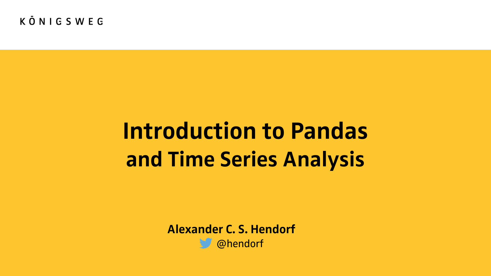

# data2day-2016
Live code samples for "Einführung Datenanalyse mit Pandas" at data2day conference, Karlsruhe 2016

Slides (German) included: Slides-Introduction to Pandas and Time Series Analysis.pdf.




Having [Anaconda](https://www.continuum.io/downloads) installed simply create your ENV with 

```conda env create -f environment.yml``` 
